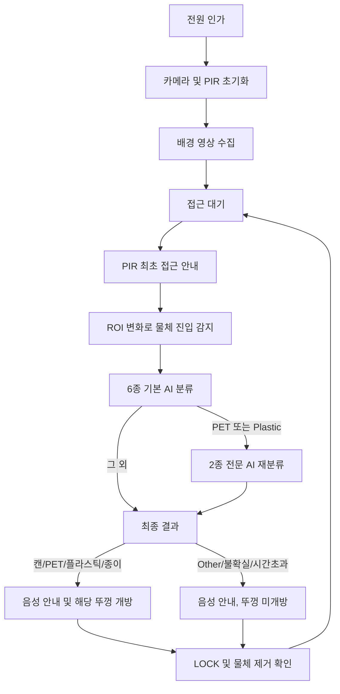

# AI 인식 기반 선택 개방형 스마트 분리수거함

> 제24회 임베디드SW경진대회 출품작  
> **시각장애인 및 저시력자를 위한 AI 인식 기반 선택 개방형 스마트 분리수거함**

사용자가 쓰레기를 카메라 인식 구역에 보여주면 Raspberry Pi 5가 종류를 판별하고, 음성으로 배출 방법을 안내한 뒤 해당 분류 칸의 뚜껑만 자동으로 엽니다. 사용자는 수거함의 글자나 색을 직접 확인하지 않고도 열린 칸에 쓰레기를 배출할 수 있습니다.

## 주요 기능

- 캔, 투명 페트병, 플라스틱 용기, 종이컵 4종 선택 개방
- 6종 기본 모델과 PET/플라스틱 전문 모델을 결합한 2단계 AI 분류
- PIR과 카메라 준비 완료 후 최초 접근 안내 1회
- 정상 분류, `other`, 불확실, 시간초과, 장시간 LOCK 상태 음성 안내
- PCA9685와 MG90S 서보모터를 이용한 해당 칸 자동 개방
- 동일 물체 중복 인식 방지 및 제거 확인 상태 머신
- 장치 내부 TFLite/WAV 기반 오프라인 실행
- `systemd`를 이용한 부팅 자동 실행

## 동작 흐름



## 분류 및 서보 채널

| 내부 라벨 | 의미 | PCA9685 채널 |
|---|---|---:|
| `can` | 캔 | 0 |
| `clear_pet` | 투명 페트병 | 4 |
| `plastic` | 플라스틱 용기 | 11 |
| `paper` | 종이컵·종이류 | 15 |
| `other` | 지원하지 않는 물체 | 개방 안 함 |
| `background` | 물체 없음 | 개방 안 함 |

## AI 모델

### 기본 모델

- MobileNetV2 α=0.5
- 입력: `1 × 224 × 224 × 3`, RGB `float32`
- 출력: 6개 클래스
- 테스트 정확도: 약 **86.18%**
- MobileNetV2 전처리가 모델 그래프 내부에 포함되어 런타임 추가 정규화 금지

### PET/플라스틱 전문 모델

- MobileNetV2 α=0.5
- 출력: `clear_pet`, `plastic`
- TFLite 테스트 정확도: 약 **96.44%**
- Keras/TFLite 예측 일치율: 약 **99.78%**

세부 지표와 데이터 출처는 [`model/`](model) 메타데이터와 [MODEL_NOTICE.md](MODEL_NOTICE.md)에 기록되어 있습니다.

## 핵심 파일

| 파일 | 역할 |
|---|---|
| `smart_bin_final.py` | PIR, 안내, 하드웨어, 카메라 AI 통합 실행 |
| `smart_bin_camera_ai.py` | 기본 카메라 AI 모듈 진입점 |
| `source_parts/` | 기본 카메라 AI 원본 소스의 순서 보존 분할본 |
| `smart_bin_camera_ai_specialist.py` | PET/플라스틱 2단계 분류 연결 |
| `pet_plastic_specialist_runtime.py` | 전문 TFLite 추론 런타임 |
| `smart_bin_hardware.py` | WAV 재생, PCA9685, 서보 제어 |
| `hardware_config.json` | 채널·각도·PIR·오디오 설정 |

`smart_bin_camera_ai.py`는 `source_parts/smart_bin_camera_ai.part00.txt`부터 `part04.txt`까지를 순서대로 결합해 원본 모듈을 그대로 실행합니다.

## 하드웨어

- Raspberry Pi 5
- Raspberry Pi Camera Module 3
- PCA9685 16채널 PWM 드라이버
- MG90S 서보모터 4개
- HC-SR501 계열 PIR 센서
- 5V 10A 외부 SMPS
- USB 오디오 출력 장치

배선과 전원 주의사항은 [docs/HARDWARE.md](docs/HARDWARE.md)를 확인하십시오.

## 설치

```bash
sudo apt update
sudo apt install -y \
  python3-venv python3-picamera2 python3-libcamera \
  python3-opencv alsa-utils i2c-tools ffmpeg

cd /home/smini131
git clone https://github.com/smini131-maker/ai-smart-recycling-bin.git smart_bin
cd smart_bin

python3 -m venv --system-site-packages .venv
source .venv/bin/activate
python -m pip install --upgrade pip
pip install -r requirements.txt
```

I²C 점검:

```bash
sudo i2cdetect -y 1
```

정상 배선에서는 PCA9685 주소 `0x40`이 표시되며 `0x70`은 All Call 주소로 함께 나타날 수 있습니다.

## 실행용 모델·음성 자산

프로그램 실행에는 다음 최종 자산이 필요합니다.

```text
model/garbage_classifier.tflite
model/pet_plastic_classifier.tflite
audio/ready.wav
audio/can.wav
audio/clear_pet.wav
audio/plastic.wav
audio/paper.wav
audio/other.wav
audio/background.wav
audio/uncertain.wav
audio/timeout.wav
audio/remove_wait.wav
```

현재 소스와 모델 메타데이터는 공개되어 있으며, Raspberry Pi에서 사용 중인 최종 TFLite/WAV 자산은 제출 마감 전 최종 커밋으로 반영합니다. 모델 해시는 [MODEL_CHECKSUMS.sha256](MODEL_CHECKSUMS.sha256)에 기록되어 있습니다.

## 직접 실행

```bash
cd /home/smini131/smart_bin
source .venv/bin/activate
GPIOZERO_PIN_FACTORY=lgpio python -u smart_bin_final.py
```

## 부팅 자동 실행

```bash
sudo cp systemd/smart-bin.service /etc/systemd/system/
sudo systemctl daemon-reload
sudo systemctl enable --now smart-bin.service
sudo systemctl status smart-bin.service --no-pager
```

로그 확인:

```bash
sudo journalctl -u smart-bin.service -f
```

자세한 절차는 [docs/DEPLOYMENT.md](docs/DEPLOYMENT.md)를 확인하십시오.

## 제출 전 점검

소스와 설정만 점검:

```bash
python scripts/preflight.py --source-only
```

모델과 WAV까지 모두 포함한 최종 점검:

```bash
python scripts/preflight.py
```

## 대회 제출 링크

- GitHub 소스코드: **https://github.com/smini131-maker/ai-smart-recycling-bin**
- 시연 영상: YouTube 업로드 후 [SUBMISSION.md](SUBMISSION.md)에 추가

## 개발자

- 정승민
- 인공지능공학부

## 라이선스 및 데이터

작성 소스코드는 [LICENSE](LICENSE)의 MIT License를 따릅니다. 원본 학습 데이터는 저장소에 포함하지 않으며, 데이터와 모델 자산은 각 제공기관의 이용조건을 따릅니다.
