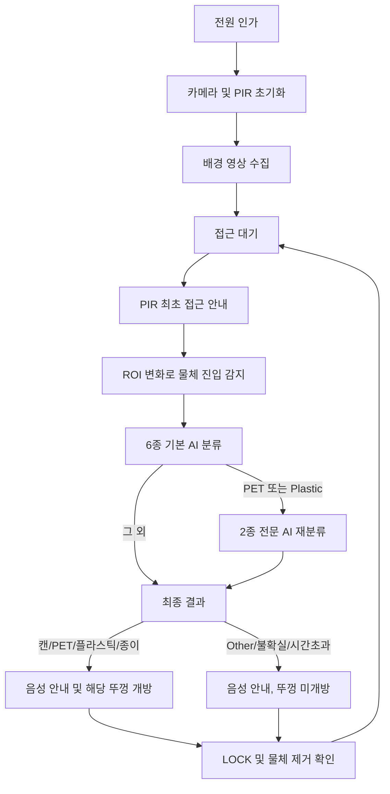

# AI 인식 기반 선택 개방형 스마트 분리수거함

> 제24회 임베디드SW경진대회 출품작  
> **시각장애인 및 저시력자를 위한 AI 인식 기반 선택 개방형 스마트 분리수거함**

사용자가 쓰레기를 카메라 인식 구역에 보여주면 Raspberry Pi 5가 종류를 판별하고, 음성으로 배출 방법을 안내한 뒤 해당 분류 칸의 뚜껑만 자동으로 엽니다. 사용자는 수거함의 글자나 색을 직접 확인하지 않고도 열린 칸에 쓰레기를 배출할 수 있습니다.

## 주요 기능

- **4종 선택 개방:** 캔, 투명 페트병, 플라스틱 용기, 종이컵
- **2단계 AI 분류:** 6종 기본 분류 후 투명 PET/플라스틱 전문 모델 추가 판정
- **접근 안내:** PIR 센서와 카메라 준비가 끝난 뒤 최초 접근 시 안내 음성 1회 재생
- **음성 안내:** 정상 분류, 미지원 물체(`other`), 불확실, 시간초과, 물체 제거 요청
- **자동 뚜껑:** PCA9685와 MG90S 서보모터로 해당 칸만 개방
- **중복 투입 방지:** 동일 물체가 남아 있으면 LOCK 상태를 유지하고 제거 안내
- **오프라인 실행:** AI 모델과 WAV 파일을 장치 내부에서 실행하며 인터넷 연결 불필요
- **부팅 자동 실행:** `systemd` 서비스 지원

## 동작 흐름



## 분류 클래스

| 내부 라벨 | 의미 | 서보 채널 |
|---|---|---:|
| `can` | 캔 | 0 |
| `clear_pet` | 투명 페트병 | 4 |
| `plastic` | 플라스틱 용기 | 11 |
| `paper` | 종이컵·종이류 | 15 |
| `other` | 지원하지 않는 물체 | 개방 안 함 |
| `background` | 물체 없음 | 개방 안 함 |

## AI 모델

### 기본 모델

- MobileNetV2 α=0.5
- 입력: `1 × 224 × 224 × 3`, RGB `float32`
- 출력: 6개 클래스
- 테스트 정확도: 약 **86.18%**
- 전처리: MobileNetV2 `preprocess_input`이 모델 내부에 포함되어 있으므로 런타임에서 추가 정규화하지 않음

### PET/플라스틱 전문 모델

- MobileNetV2 α=0.5
- 출력: `clear_pet`, `plastic`
- TFLite 테스트 정확도: 약 **96.44%**
- Keras/TFLite 예측 일치율: 약 **99.78%**

세부 정보는 [`model/`](model) 안의 메타데이터 JSON과 [MODEL_NOTICE.md](MODEL_NOTICE.md)를 확인하십시오.

## 하드웨어

- Raspberry Pi 5
- Raspberry Pi Camera Module 3
- PCA9685 16채널 PWM 드라이버
- MG90S 서보모터 4개
- HC-SR501 계열 PIR 센서
- 5V 10A 외부 SMPS
- USB 오디오 출력 장치

배선과 전원 주의사항은 [docs/HARDWARE.md](docs/HARDWARE.md)에 정리되어 있습니다.

## 설치

Raspberry Pi OS에서:

```bash
sudo apt update
sudo apt install -y \
  python3-venv python3-picamera2 python3-libcamera \
  python3-opencv alsa-utils i2c-tools ffmpeg

cd /home/smini131
git clone https://github.com/smini131-maker/ai-smart-recycling-bin.git smart_bin
cd smart_bin

python3 -m venv --system-site-packages .venv
source .venv/bin/activate
python -m pip install --upgrade pip
pip install -r requirements.txt
```

I²C를 활성화한 뒤 PCA9685가 보이는지 확인합니다.

```bash
sudo i2cdetect -y 1
```

정상 배선에서는 `0x40`이 표시되며 `0x70`은 PCA9685 All Call 주소로 함께 나타날 수 있습니다.

## 실행

```bash
cd /home/smini131/smart_bin
source .venv/bin/activate
GPIOZERO_PIN_FACTORY=lgpio python -u smart_bin_final.py
```

메인 진입점은 [`smart_bin_final.py`](smart_bin_final.py)입니다.

## 부팅 자동 실행

```bash
sudo cp systemd/smart-bin.service /etc/systemd/system/
sudo systemctl daemon-reload
sudo systemctl enable --now smart-bin.service
sudo systemctl status smart-bin.service --no-pager
```

실시간 로그:

```bash
sudo journalctl -u smart-bin.service -f
```

자동 실행 설정은 [docs/DEPLOYMENT.md](docs/DEPLOYMENT.md)를 확인하십시오.

## 테스트

```bash
source .venv/bin/activate

python tests/check_system.py
python tests/test_audio.py other
python tests/test_audio.py remove_wait
python tests/test_all_servos.py
python tests/test_pir_audio.py
```

전체 제출 전 점검:

```bash
python scripts/preflight.py
```

## 저장소 구성

```text
.
├── smart_bin_final.py
├── smart_bin_camera_ai.py
├── smart_bin_camera_ai_specialist.py
├── pet_plastic_specialist_runtime.py
├── smart_bin_hardware.py
├── hardware_config.json
├── model/
├── audio/
├── tests/
├── scripts/
├── systemd/
└── docs/
```

## 대회 제출 링크

- 소스코드: **https://github.com/smini131-maker/ai-smart-recycling-bin**
- 시연 영상: YouTube 업로드 후 [`SUBMISSION.md`](SUBMISSION.md)에 추가

## 개발자

- 정승민
- 인공지능공학부

## 라이선스 및 데이터

소스코드는 [LICENSE](LICENSE)의 MIT License를 따릅니다. 학습 원본 데이터는 이 저장소에 포함하지 않습니다. 학습 데이터와 모델 자산의 이용조건은 각 데이터 제공기관의 약관을 따릅니다.
